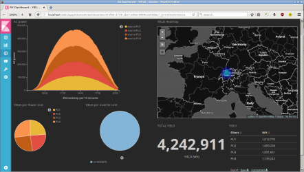
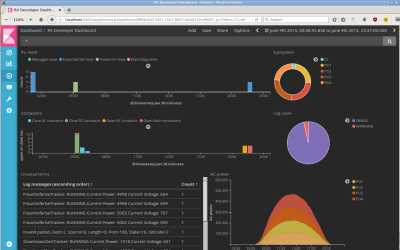
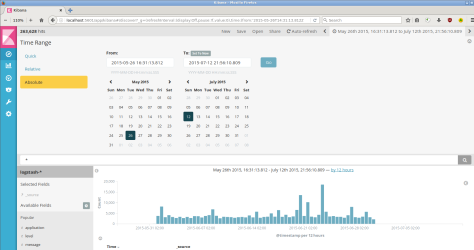

Solar inverter dashboard
========================

This demo shows how to use [elastic](https://www.elastic.co/products) as development tool for monitoring distributed embedded systems like solar central inverters.

[Log files](data/2015-06-01_00-00-00_testlog.txt) can be parsed in [Logstash](docker-elk/logstash/pipeline/logstash.conf) with [Grok patterns](docker-elk/logstash/patterns/solarmax-rx.conf) and visualized as [Kibana dashboard](docker-elk/kibana/config/export.json):






HOW TO
------

1. Check the system requirements
   * Docker host (e.g. Linux, tested on Debian Stretch 9 and Ubuntu 16.04 with Docker version 17.04.0-ce and docker-compose version 1.11.2.)
   * 8 GB RAM or more
2. Install [docker](https://docs.docker.com/engine/installation/) and [docker-compose](https://docs.docker.com/compose/install/). Make sure Docker works with your login:

    ```
    [debian 21:31] ~/git/tinytux/solar-dashboard (master)*$ docker run hello-world
    Unable to find image 'hello-world:latest' locally
    latest: Pulling from library/hello-world
    78445dd45222: Pull complete
    Digest: sha256:c5515758d4c5e1e838e9cd307f6c6a0d620b5e07e6f927b07d05f6d12a1ac8d7
    Status: Downloaded newer image for hello-world:latest

    Hello from Docker!
    This message shows that your installation appears to be working correctly.    
    ```
3. [elasticsearch requires max_map_count](https://www.elastic.co/guide/en/elasticsearch/reference/current/vm-max-map-count.html) to be at least 262144. Run the following command (settings will be lost after reboot):
    ```
    sudo sysctl -w vm.max_map_count=262144
    ```
4. Clone this repository and start the ELK stack:
    ```
    $ git clone https://github.com/tinytux/solar-dashboard.git
    $ ./elk.sh start
    ```
5. After 30-40 seconds, check if elasticsearch is up and running: [http://localhost:9200/_search?pretty=true](http://localhost:9200/_search?pretty=true)
6. Open a second terminal window and start feeding (this can take a few minutes):
    ```
    $ ./feed.sh ./data/*syslog.txt | nc -q 5 localhost 5000
    ```
7. elasticsearch should contain now around 263'000 elements: [http://localhost:9200/_search?pretty=true](http://localhost:9200/_search?pretty=true)
8. Visit Kibana [http://localhost:5601/app/kibana](http://localhost:5601/app/kibana) and add the logstash index.
9. Go to the "Management", "Saved Objects" tab and click "Import" to load [Kibana dashboard](docker-elk/kibana/config/export.json)
10. Set the time Time Range filter to 2015 (else you will not see any logs):



A simpler dashboard without Docker can be found [here](https://github.com/tinytux/sensor).
